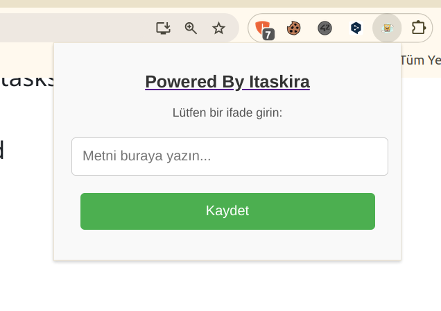

# Macro Chrome Extension

**Macro** is a Chrome extension developed to automate and streamline repetitive tasks on the web. With customizable keyboard shortcuts, this extension allows users to quickly insert predefined text into any editable field on websites, making it a useful tool for anyone looking to save time while filling out forms, sending messages, or completing other repetitive text-entry tasks.

## Features

- **Customizable Keyboard Shortcuts**: Set your own key combinations to trigger the insertion of predefined text into any editable field.
- **Universal Support**: Works with most websites that allow text input (text fields, textareas, and content-editable areas).
- **Time-Saving Automation**: Reduce the amount of time spent on typing the same phrases or messages repeatedly.
- **Simple Setup**: Easily configure the extension from the popup to set your desired text and key combinations.
- **Default Macro**: The extension comes with a default text snippet that can be modified or replaced with your own.

## Installation

To install ** Macro** and start using it:

1. Clone or download this repository to your local machine.
2. Open Google Chrome and go to the Extensions page: `chrome://extensions/`.
3. Enable **Developer mode** at the top right.
4. Click on **Load unpacked** and select the folder where the extension files are stored.
5. The extension icon should now appear in your browser's toolbar.

## Usage

1. **Open the Extension Popup:**
   - Click on the extension icon in the browser toolbar to open the popup.

2. **Set Predefined Text:**
   - In the popup, you can enter your predefined text in the input field. This text will be inserted into editable fields on any website.

3. **Assign a Keyboard Shortcut:**
   - Choose a keyboard shortcut (e.g., `Ctrl+Alt+Y`) that will trigger the insertion of your predefined text.

4. **Insert Text:**
   - Whenever you're on a site with an editable text field (like a text box, textarea, or content-editable area), use the assigned keyboard shortcut to quickly insert your predefined text.

5. **Editing Default Macros:**
   - The extension comes with a default macro (e.g., "Hello, how can I assist you today?"). You can edit this default text directly in the popup. 
   - To update the macro, simply change the text in the input field and reassign the keyboard shortcut if necessary.

6. **Save and Use Multiple Macros:**
   - You can create multiple macros by setting different text snippets and corresponding keyboard shortcuts. 
   - These can be managed directly within the popup.

## Configuration

The extension can be easily configured via the popup interface. You can:

- **Modify Default Text:** The default macro is "Hello, how can I assist you today?" but you can change it to anything you like.
- **Assign Custom Shortcuts:** Choose different keyboard combinations for each macro you define.
- **Delete or Reset Macros:** You can remove or reset any macro to restore it to its default state.

### Example of Default Macro:
- **Text:** "Hello, how can I assist you today?"
- **Shortcut:** `Ctrl+Alt+T` (This is the default but can be changed)

### To Change the Default Macro:
1. Open the extension popup.
2. Change the text in the input field.
3. Set a new keyboard shortcut, if desired.
4. The new macro will be saved and available for use.

## Contributing

Feel free to fork this repository and submit pull requests. If you have any ideas for new features or improvements, don't hesitate to contribute!

1. Fork the repository.
2. Create your feature branch (`git checkout -b feature-name`).
3. Commit your changes (`git commit -am 'Add new feature'`).
4. Push to the branch (`git push origin feature-name`).
5. Create a new pull request.

## Contact

If you have any questions or feedback, feel free to open an issue or contact me directly.

